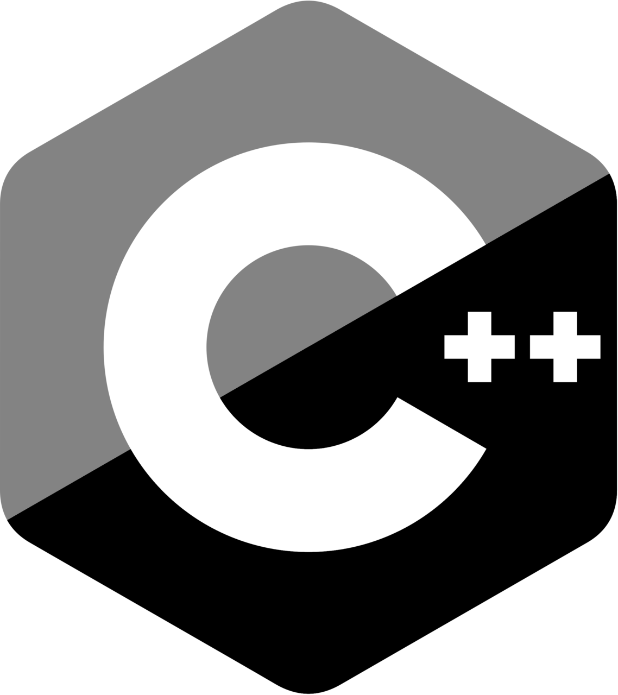

# COMP-345-Assignment

  <a href="https://github.com/CSG48-TZ/comp-345-a1">
  
    <h1 align="center">COMP 345: Assignment</h1>
  </a>

  
  

# Project Information

[**Assignment Part 1**](./Assets/a1.pdf)
 
[**Assignment Part 1 Grading Scheme**](./Assets/a1gs.pdf)

## Team Members 

<table>
  <tr>
    <td align="center"><a href="https://github.com/CSG48-TZ"> <b> Tongwei Zhang</b></a></td>
        <td align="center"><a href="https://github.com/"> <b>Salman Hussain Ali</b></a></td> 
  </tr>
  <tr>
   <td align="center"><a href="https://github.com/DaxInvader"> <b>Dario Cimmino</b></a></td>
<td align="center"><a href="https://github.com/"> <b>Placeholder</b></a></td> 
  </tr>
</table>

 

Concordia University 2023
